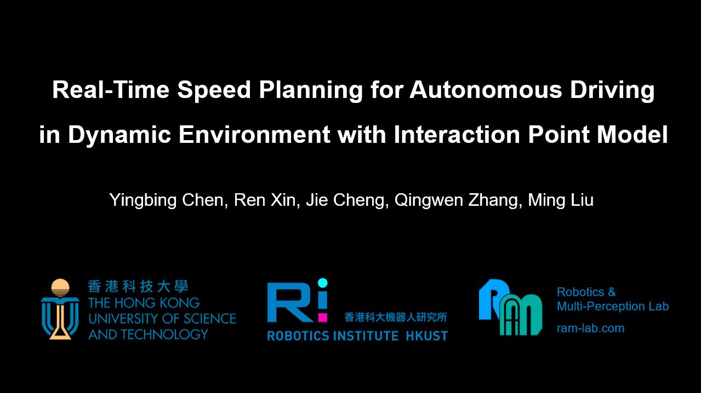

# IPM Planner

- 03/20/2022: Initialization.

## 0. Structure

IPM-Planner/

- mlp_model/: MLP model .py .pt files.

## 1. Introduction

This is the project page of the paper "**Real-Time Speed Planning for Autonomous Driving in Dynamic Environment with Interaction Point Model**".

# 2. Complementary Videos

- Pairs of interactions from the INTERACTION dataset [1].

## Reference

[1] Zhan W, Sun L, Wang D, et al. Interaction dataset: An international, adversarial and cooperative motion dataset in interactive driving scenarios with semantic maps[J]. arXiv preprint arXiv:1910.03088, 2019.
