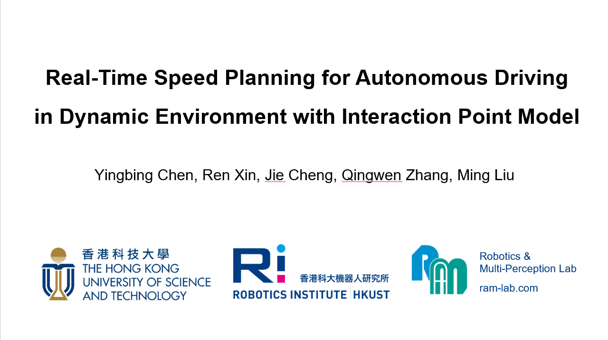

# IPM Planner

- 03/11/2022: Initialization.

## 1. Introduction

This is the project page of the paper "**Real-Time Speed Planning for Autonomous Driving in Dynamic Environment with Interaction Point Model**".

## 2. Complementary Videos

- Pairs of interactions from INTERACTION dataset [1].

## Reference

[1] Zhan W, Sun L, Wang D, et al. Interaction dataset: An international, adversarial and cooperative motion dataset in interactive driving scenarios with semantic maps[J]. arXiv preprint arXiv:1910.03088, 2019.