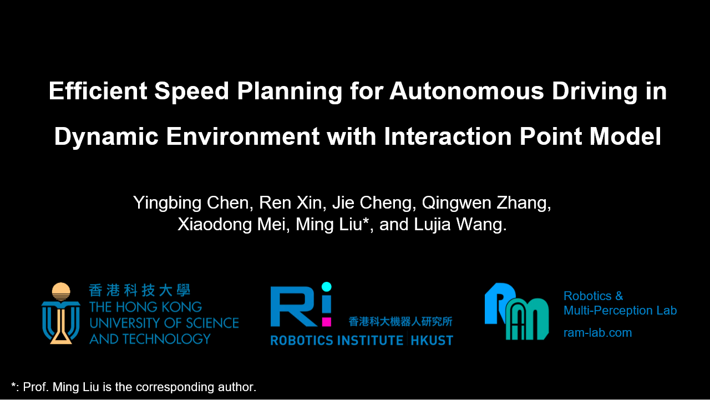

# IPM-Planner

- 2022/03/20: Initialization.
- 2022/07/14: Update with separate fitting curves.
- 2022/09/04: Accepted by RA-L.

## Structure

```
IPM-Planner
├── dt_model                    - Protection time: fitting curves
│   └── dtmodel.py				- fitting coeffients C_{1-4}
├── mlp_model                   - Priority: trained MLP
│   ├── ipmodel.ckpt
│   ├── ipmodel.pt
│   └── mlp_model.py
└── utils                       - bin file io
    └── bin_file_io.py
```


## Introduction

This is the project page of the paper "**Efficient Speed Planning for Autonomous Driving in Dynamic Environment with Interaction Point Model**".

[](https://youtu.be/n644Pj4Q9yo)


The preprint version of our paper presenting the IPM-based planner is now available on arXiv: https://arxiv.org/abs/2209.09013.


## CITATION

```
TODO
```


## Complementary Videos

- Pairs of interactions from the INTERACTION dataset [1], where "**x**" denotes the interaction point.


## Reference

[1] Zhan W, Sun L, Wang D, et al. Interaction dataset: An international, adversarial and cooperative motion dataset in interactive driving scenarios with semantic maps[J]. arXiv preprint arXiv:1910.03088, 2019.
